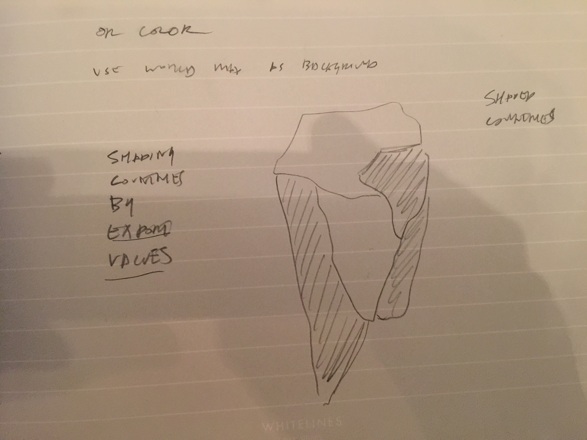

# Open Design 

My intention with the open design is to combine the lat/long diagram and the hover trade connections to light up trade partners when you mouse over them. This is intended to give a spatial component to trade which is lacking in the circular design. As far as a design I think it's fairly obvious (which is not a bad thing), but technically it will involve some interesting explorations.

# Visual Design

* lat/long node based map with connecting trade routes on node hover

# Interaction

* mouse over
* highlight trade partners

# Further Explorations

* changing visual variables such as color or texture depending on volume of trade
* using SVG world map to highlight country shapes instead of nodes

# Implementation

* start with  lat/long map to prototype visual efficacy

